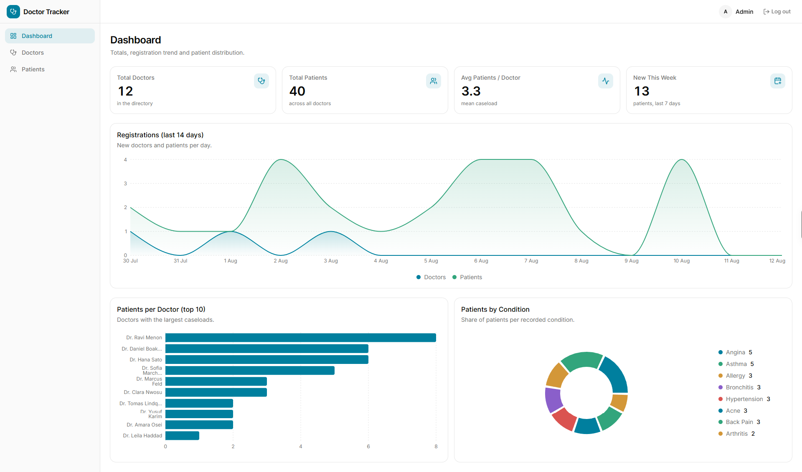
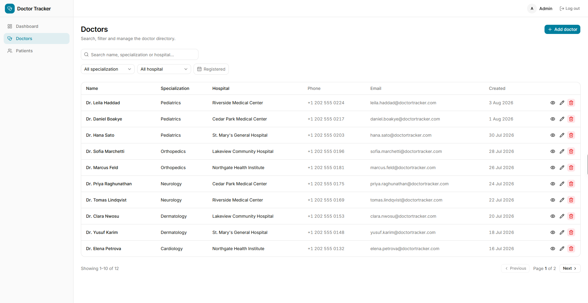
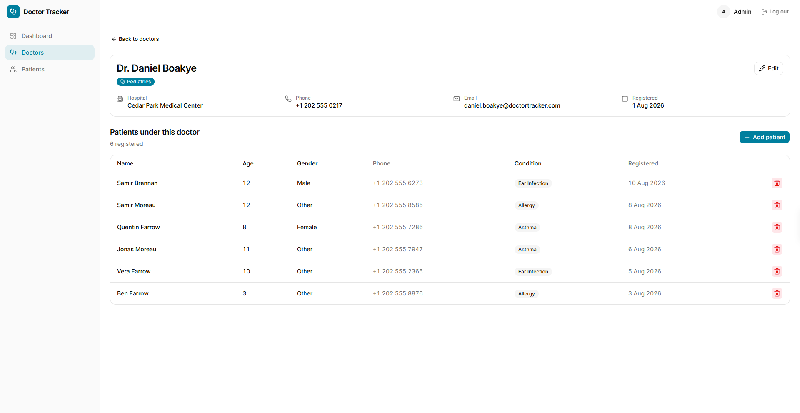
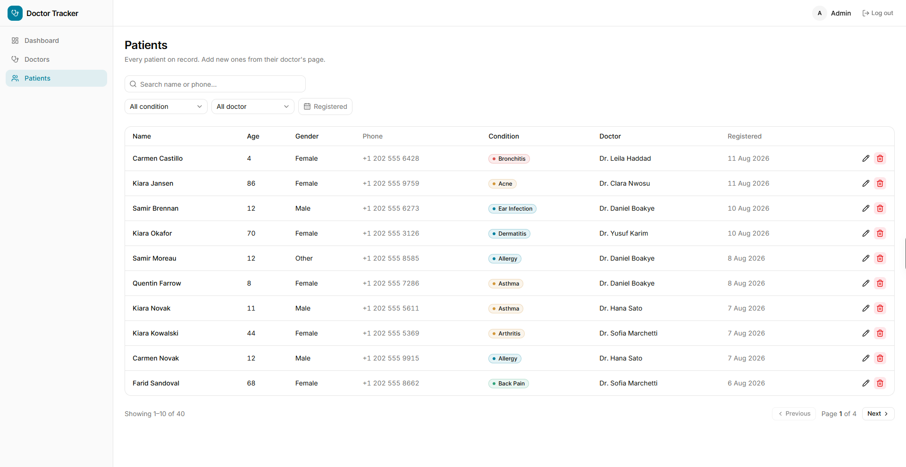
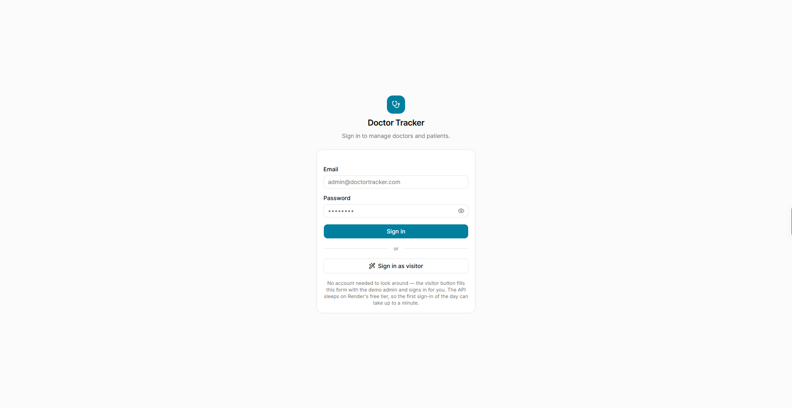
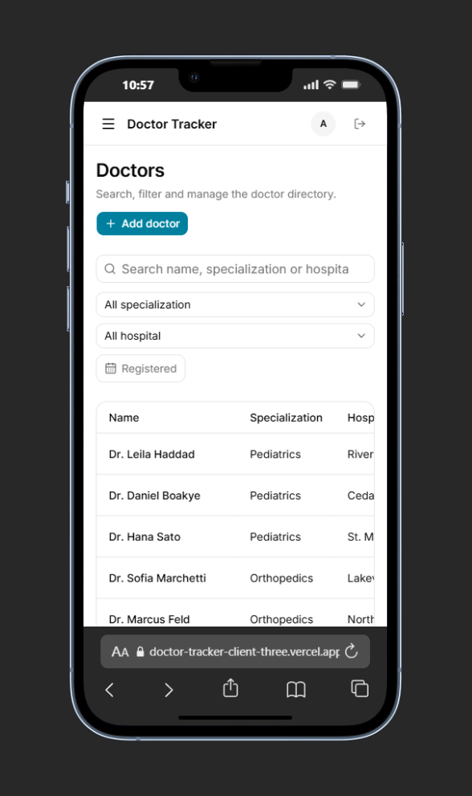
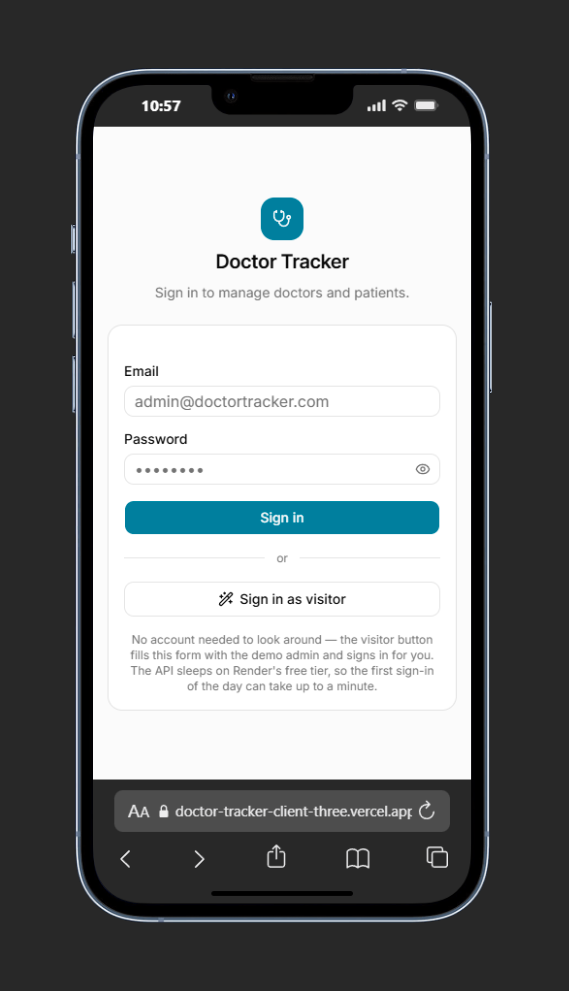

# Doctor Tracker

An admin panel for a clinic's records. A single administrator signs in and manages
doctors and the patients under each of them — create, search, filter, paginate,
edit, delete — and a dashboard reads the whole database back as aggregated
statistics: totals, patients per doctor, registrations over the last fortnight, and
the spread of conditions. Built as a Next.js (App Router) client in TypeScript,
talking to a separate Express + MongoDB API, with the session held in an httpOnly
cookie that the browser is never able to read.

This is the **frontend** repo and the primary README for the project.

| | |
| --- | --- |
| **Live app** | https://doctor-tracker-client-three.vercel.app |
| **Live API** | https://doctor-tracker-server.onrender.com/api |
| **Frontend repo** | https://github.com/ar-saad/doctor-tracker-client |
| **Backend repo** | https://github.com/ar-saad/doctor-tracker-server |

> **Cold start:** the API is on Render's free tier, so it sleeps after a period of
> inactivity. The **first request after idle can take ~50 seconds** — the login
> button will sit in its loading state for that long, once. Every request after
> that is normal speed. Loading `/api/health` on the API URL first wakes it up.

---

## Credentials

```
Email:    admin@doctortracker.com
Password: Admin@123
```

There is one seeded administrator; the app has no public sign-up, which matches
the brief — this is an internal admin panel, not a multi-tenant product.

---

## Setup

Running the whole thing locally means running both repos. Start with the API.

**Prerequisites:** Node.js 20+, and a MongoDB connection string (a free Atlas M0
cluster, or a local `mongod`).

### 1. The API

```bash
git clone https://github.com/ar-saad/doctor-tracker-server.git
cd doctor-tracker-server
npm install
cp .env.example .env
```

Fill in `.env` — `MONGODB_URI` and `JWT_SECRET` are the two that have no usable
default:

```ini
PORT=5000
NODE_ENV=development
MONGODB_URI=mongodb+srv://<user>:<password>@<cluster>.mongodb.net/doctor-tracker?retryWrites=true&w=majority
JWT_SECRET=replace-with-a-long-random-string     # minimum 16 characters
JWT_EXPIRES_IN=7d
ADMIN_NAME=Admin
ADMIN_EMAIL=admin@doctortracker.com
ADMIN_PASSWORD=Admin@123
```

All eight are validated at boot; a missing one exits with a readable list rather
than failing later. Then seed and run:

```bash
npm run seed:admin     # the admin login above — idempotent
npm run seed:demo      # 12 doctors + 40 patients, so the charts have something to draw
npm run dev            # http://localhost:5000/api
```

`npm run seed:demo` is worth running: the dashboard is not much to look at against
an empty database.

### 2. This app

In a second terminal:

```bash
git clone https://github.com/ar-saad/doctor-tracker-client.git
cd doctor-tracker-client
npm install
cp .env.example .env.local
```

`.env.local` needs one variable — the API's base URL, **without** a trailing `/api`:

```ini
API_URL=http://localhost:5000
```

It has no `NEXT_PUBLIC_` prefix on purpose. It is read only on the server, by
`next.config.ts` and by Server Components, so the backend's address is never
shipped to the browser. Then:

```bash
npm run dev            # http://localhost:3000
```

Open http://localhost:3000, sign in with the credentials above, and you should
land on the dashboard.

### Scripts

| Script | Does |
| --- | --- |
| `npm run dev` | Development server on :3000 |
| `npm run build` | Production build |
| `npm start` | Serves the production build |
| `npm run lint` | ESLint |

---

## System architecture

```
                    ┌──────────────────────────────────────┐
   Browser ────────▶│  Next.js  (Vercel)                   │
   fetch("/api/…")  │  ─ App Router pages + Server Comps.  │
   same-origin only │  ─ proxy.ts   route guard            │
                    │  ─ rewrites   /api/* ──────┐         │
                    └────────────────────────────┼─────────┘
                                                 │  server-to-server
                                                 ▼
                                   ┌───────────────────────────┐
                                   │  Express API  (Render)    │
                                   │  JWT + bcrypt, Zod, CRUD  │
                                   │  aggregation pipelines    │
                                   └─────────────┬─────────────┘
                                                 ▼
                                        MongoDB Atlas
```

**The browser never talks to Render.** Every request the client makes is a
relative `/api/*` on its own origin; `next.config.ts` rewrites those through to
the Express service server-side. That single fact is what makes the auth design
work, and decision #1 below is about why.

**The auth flow.** `POST /api/auth/login` verifies the password with bcrypt, signs
a JWT, and returns it as an `httpOnly`, `SameSite=Lax`, `Secure`-in-production
cookie. The token is never in a response body and never touched by JavaScript.
The browser reattaches it automatically on every subsequent same-origin request;
Express's `auth` middleware verifies it and hangs the user id on the request.
`GET /api/auth/me` restores the topbar user on a hard refresh. Logout clears the
cookie with the same options it was set with.

Two layers of route protection, and they are not the same thing:

- [`src/proxy.ts`](src/proxy.ts) (Next.js 16's rename of `middleware.ts`) redirects
  a visitor with no cookie away from dashboard URLs. It checks that the cookie is
  **present**, not that it is valid — the JWT secret lives on the API, not here.
  This is a UX layer.
- The Express API verifies the signature on **every single request**. That is the
  actual security boundary. A forged cookie gets you a page whose every fetch
  then 401s, and `lib/api.ts` bounces you to `/login` on the first one.

### Project layout

```
src/
  app/
    login/                  the only public route
    (dashboard)/            route group behind the app shell
      page.tsx              dashboard + charts
      doctors/              list and detail (a doctor's patients)
      patients/             list with combined filters
  components/               this app's own composition layer
    ui/                     shadcn/Radix primitives — generated, treated as vendored
  hooks/                    useListParams (URL state), useFetch
  lib/                      api.ts (browser), server-api.ts (RSC), validation, format
  types/                    the client half of the API contract
  proxy.ts                  route guard
```

Tailwind CSS v4 with shadcn/ui on Radix primitives. Radix means the dialogs,
selects and dropdowns arrive with focus traps, escape handling and ARIA already
correct rather than reimplemented badly. Theming is CSS variables in
`globals.css` — `--primary` and `--chart-1..5` are each defined in one place.
Charts are Recharts.

List state — page, search, every filter — lives in the URL rather than in
`useState` ([`src/hooks/useListParams.ts`](src/hooks/useListParams.ts)). Three
things fall out of that for free: the URL is shareable, Back steps through filter
changes, and a refresh restores exactly what was on screen.

---

## Technical decisions

### 1. httpOnly cookie auth, made possible by a Next.js rewrite proxy

**Not `localStorage`.** A JWT in `localStorage` is readable by any JavaScript
running on the page — so a single XSS anywhere, including in a transitive
dependency, hands over a valid session token that the attacker can exfiltrate and
replay from their own machine until it expires. An `httpOnly` cookie is not
reachable from JavaScript at all. XSS on an httpOnly-cookie app can still make
requests *as* the user while the page is open, which is bad, but the token itself
never leaves the browser. That is a materially smaller blast radius, and it is the
reason no code in this repo ever reads, writes, or even names a token.

**The problem that creates.** The two halves of this project deploy to two
different sites: `doctor-tracker-client.vercel.app` and
`doctor-tracker-server.onrender.com`. If the browser called Render directly, the
`Set-Cookie` coming back would be a **third-party cookie** — a different
registrable domain from the page the user is on. That cookie would need
`SameSite=None; Secure` to be sent at all, and Safari's ITP blocks third-party
cookies outright, as does Firefox's Total Cookie Protection and, increasingly,
Chrome. The result is an app that works on the developer's machine and fails for
a reviewer on a Mac. It would also need a full CORS configuration with
`credentials: true` and an exact-origin allowlist.

**The fix.** `next.config.ts` rewrites `/api/:path*` to `${API_URL}/api/:path*`.
The browser only ever issues same-origin requests to the Vercel domain; Next.js
forwards them server-to-server. The cookie is therefore **first-party**:
`SameSite=Lax` is enough, no browser's third-party policy applies, and CORS
disappears entirely because there is no cross-origin request left to preflight.
The backend needs no `CLIENT_URL` variable and no `cors` middleware. It also means
the backend URL is a server-side secret rather than something in the JS bundle,
and repointing the client at a different API is one Vercel env var and a redeploy,
with no backend change at all.

**The residual risk, honestly.** `SameSite=Lax` does not stop CSRF the way a token
does; it stops it for the cases that matter here. Lax withholds the cookie from
cross-site **`POST`s** — which is every state-changing route in this API — while
still sending it on top-level GET navigations so that following a link into the
app doesn't dump you at the login screen. Since no `GET` in this API mutates
anything, the exposure is small enough that a CSRF token would be ceremony rather
than defence at this scale.

**What I would add at larger scale.** A short-lived access token with refresh-token
rotation, so a stolen session dies in minutes rather than a day; a per-session
double-submit CSRF token once any non-idempotent GET or third-party embed exists;
a server-side session/deny list so logout and "sign out everywhere" can actually
revoke a token, which a stateless JWT cannot; and rate limiting on `/auth/login`.

### 2. Server-side aggregation pipelines, not client-side computation

The dashboard shows four things: totals, patients per doctor, a 14-day
registrations trend, and the distribution of conditions. The easy version fetches
`/doctors` and `/patients` and computes all four in React with `reduce`. This
project computes them in MongoDB, in
[`analyticsController.ts`](https://github.com/ar-saad/doctor-tracker-server/blob/master/src/controllers/analyticsController.ts).

**Round trips.** The naive version needs at least two requests before it can render
anything, and both must finish. `/analytics/summary` is one request. Inside it,
six independent queries run concurrently under a single `Promise.all`, so the
endpoint costs roughly one query's latency rather than six — which matters
disproportionately on a free-tier host whose baseline latency is already high.

**Payload growth.** This is the real argument. Client-side computation transfers
every document to compute a handful of numbers, so the payload grows **linearly
with the collection** while the output stays a fixed size. At the seeded 52
documents nobody notices. At 50,000 patients the browser is downloading megabytes
of records — over mobile data, into a parse, into a `reduce` on the main thread —
to draw eight donut slices. The aggregation response is the size of the chart, not
the size of the database: `$group` collapses the rows inside the server, and
`$limit` caps the top-10 doctors and top-8 conditions before anything is
serialised. Payload size stops tracking data volume at all.

**The indexes line up with the pipelines.** This is why the two decisions are one
decision. The indexes declared on the models — `createdAt` on both collections,
`doctor` and `condition` on patients — are exactly the fields the pipelines
`$match`, `$group` and `$sort` on. The trend pipeline `$match`es
`createdAt >= start` and groups by a `$dateToString` of it; patients-per-doctor
groups on `doctor`; the conditions donut groups on `condition`. Each one is served
by an index rather than a collection scan, and `$match` sits first in the trend
pipeline so the index narrows the document set *before* the grouping stage sees
it. Aggregating server-side is only cheap if the fields being aggregated are
indexed; doing one without the other is the version that falls over.

**One correctness note.** Mongo only returns days that actually have documents. A
line chart drawn straight from that closes the gaps and draws a quiet Tuesday as a
straight line between its neighbours — a chart that lies. The API zero-fills every
day in the window, in UTC, to match the UTC bucketing of `$dateToString`.

---

## Visual evidence

| | |
| --- | --- |
| **Dashboard** |  |
| **Doctors — search, filters, pagination** |  |
| **Doctor detail with patients** |  |
| **Patients** |  |
| **Sign in** |  |

Mobile:

| Dashboard | Doctors | Sign in |
| --- | --- | --- |
|  |  |  |

---

## Tech stack

**Client** — Next.js 16 (App Router), React 19, TypeScript, Tailwind CSS v4,
shadcn/ui on Radix, Recharts, date-fns, sonner.

**API** — Node.js 20, Express 5, Mongoose, MongoDB Atlas, Zod, jsonwebtoken,
bcryptjs, TypeScript (ESM/NodeNext).

Both repos are TypeScript with no `.js` source files and no `any`; `tsc --noEmit`
passes clean in each.

Types are hand-written in [`src/types/index.ts`](src/types/index.ts) to match the
backend's Zod schemas rather than shared through a package. Two separate repos
means a shared package would need publishing, versioning and a release step in the
loop of every change — for roughly 50 lines of interfaces, on a project this size,
copying them is the correct trade. The backend derives its own types from the Zod
schemas with `z.infer`, so on that side validation and types cannot drift apart at
all.

---

## Deployment

The client deploys to Vercel and the API to Render.

**Vercel** — import the repo, framework auto-detected, and set one environment
variable:

```
API_URL = https://doctor-tracker-server.onrender.com
```

`next.config.ts` reads it at build time, so it needs a redeploy after being added.
No `NEXT_PUBLIC_` prefix.

**Render** — build `npm install && npm run build`, start `npm start`, and set the
eight backend variables. `NODE_ENV=production` is not optional: it is what flips
the cookie to `Secure`, and login fails silently over HTTPS without it. Atlas
needs `0.0.0.0/0` under Network Access, since Render's egress IPs are dynamic.

Pointing the client at a different API is one Vercel variable and a redeploy —
the backend never learns the client's URL, because it never needs to. That is the
payoff of the proxy design.
